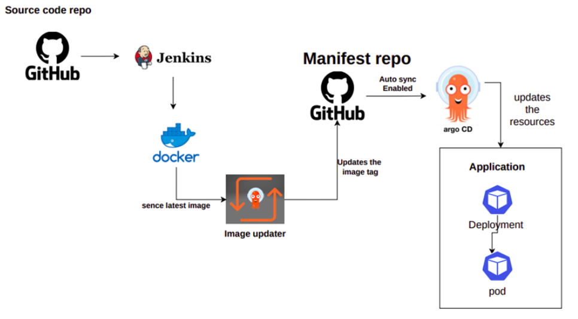

# ARGO CD
### What is Argo CD?
* Argo CD is a Kubernetes-native continuous deployment (CD) tool. Unlike external CD tools that only enable push-based deployments, Argo CD can pull updated code from Git repositories and deploy it directly to Kubernetes resources.

#### Argo CD offers the following key features and capabilities:
* Manual or automatic deployment of applications to a Kubernetes cluster.
* Automatic synchronization of application state to the current version of declarative configuration.
* Web user interface and command-line interface (CLI).
* Ability to visualize deployment issues, detect and remediate configuration drift.
* Role-based access control (RBAC) enabling multi-cluster management.
* Single sign-on (SSO) with providers such as GitLab, GitHub, Microsoft, OAuth2, OIDC, LinkedIn, LDAP, and SAML 2.0.
* Support for webhooks triggering actions in GitLab, GitHub, and BitBucket.

### How Argo CD Works?
* When using Argo CD, you can specify application configuration using several types of `Kubernetes manifests, including plain YAML or JSON manifest; Helm charts; Kustomize; and Ksonnet and Jsonnet applications.` It is also possible to use any custom configuration management tool as a plugin.
* Argo CD automatically deploys the desired state of an application in a specified target environment. Updates are traceable as tags, branches, or pinned specific versions of a manifest at Git commits.


## How to enable CI/CD with Argo CD and Jenkins
* The software team implements Continuous Integration and Delivery (CI/CD) pipelines or workflows to quickly build and release software to market.
* Large and medium enterprises will have multiple teams working on various microservices getting deployed into public clouds.
* Argo CD is the best software to achieve GitOps and arguably is also getting adopted like wildfire these days. In this blog, I will explain how to achieve CI/CD using Argo CD and Jenkins.
### CI/CD pipeline using Argo CD Image Updater, Docker Hub and Jenkins

* Jenkins for continuous integration, you would currently generate Docker images and store them in a container registry like Docker Hub. And then, you would manually update the manifest files in Git and trigger a CD pipeline (typically Spinnaker or GitHub Action) to deploy the new container image in the Kubernetes cluster. 
* Further actions click on [Refer here](https://www.opsmx.com/blog/how-to-enable-ci-cd-with-argo-cd-and-jenkins/).
```
def COLOR_MAP = [
    'SUCCESS': 'good', 
    'FAILURE': 'danger',
]

pipeline {

    agent any

	tools {
            jdk 'OracleJDK8'
	    maven 'MAVEN3'	
		
    }

    environment {
        registry = "learnwithabhi/vproappdock"
        registryCredential = 'dockerhub'
    }

    stages{

        stage('BUILD'){
            steps {
                sh 'mvn clean install -DskipTests'
            }
            post {
                success {
                    echo 'Now Archiving...'
                    archiveArtifacts artifacts: '**/target/*.war'
                }
            }
        }

        stage('UNIT TEST'){
            steps {
                sh 'mvn test'
            }
        }

        stage('INTEGRATION TEST'){
            steps {
                sh 'mvn verify -DskipUnitTests'
            }
        }

        stage ('CODE ANALYSIS WITH CHECKSTYLE'){
            steps {
                sh 'mvn checkstyle:checkstyle'
            }
            post {
                success {
                    echo 'Generated Analysis Result'
                }
            }
        }

        stage('CODE ANALYSIS with SONARQUBE') {

            environment {
                scannerHome = tool 'sonar4.7'
            }

            steps {
                withSonarQubeEnv('sonar-pro') {
                    sh '''${scannerHome}/bin/sonar-scanner -Dsonar.projectKey=vprofile \
                   -Dsonar.projectName=vprofile-repo \
                   -Dsonar.projectVersion=1.0 \
                   -Dsonar.sources=src/ \
                   -Dsonar.java.binaries=target/test-classes/com/visualpathit/account/controllerTest/ \
                   -Dsonar.junit.reportsPath=target/surefire-reports/ \
                   -Dsonar.jacoco.reportsPath=target/jacoco.exec \
                   -Dsonar.java.checkstyle.reportPaths=target/checkstyle-result.xml'''
                }

                timeout(time: 10, unit: 'MINUTES') {
                    waitForQualityGate abortPipeline: true
                }
            }
        }

        stage('Building image') {
            steps{
              script {
                dockerImage = docker.build registry + ":$BUILD_NUMBER"
              }
            }
        }
        stage('Deploy Image') {
          steps{
            script {
              docker.withRegistry( '', registryCredential ) {
                dockerImage.push("$BUILD_NUMBER")
                dockerImage.push('latest')
              }
            }
          }
        }
        stage('Remove Unused docker image') {
          steps{
            sh "docker rmi $registry:$BUILD_NUMBER"
          }
        }
    }
    post {
        always {
            echo 'Slack Notifications.'
            slackSend channel: '#jenkins-cicd',
                color: COLOR_MAP[currentBuild.currentResult],
                message: "*${currentBuild.currentResult}:* Job ${env.JOB_NAME} build ${env.BUILD_NUMBER} \n More info at: ${env.BUILD_URL}"
            }        

        }
}
```
