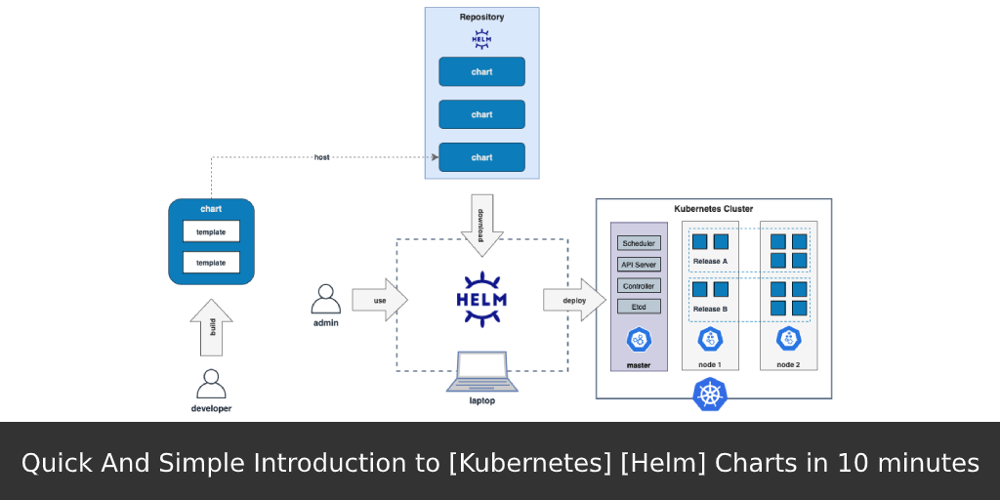

# Helm Chart

### What is Helm Chart
* **A Helm chart is a package that contains all the necessary resources to deploy an application to a Kubernetes cluster.** This includes YAML configuration files for deployments, services, secrets, and config maps that define the desired state of your application.

### Helm chart Workflow


### Helm Working
* **Helm is a powerful tool for applying, updating, and managing applications on Kubernetes. Helm Community creates a lot of open-source charts. You can deploy Redis, Nginx, or Prometheus-operator with one command. And they come with all things we need like services, ingress.**

```
$ helm create basic
Creating basic
$ tree basic
basic/
├── charts
├── Chart.yaml
├── templates
│   ├── deployment.yaml
│   ├── _helpers.tpl
│   ├── ingress.yaml
│   ├── NOTES.txt
│   ├── serviceaccount.yaml
│   ├── service.yaml
│   └── tests
│       └── test-connection.yaml
└── values.yaml
```

Deploying chart is just as easy as creating:
```
$ helm install basic
```

* **Template command is your best friend** 
* Right before installing and after changing something in chart, you should check if everything is processed in templates as expected. To check what will be deployed to cluster use command:
```
$ helm template basic
```

### Helm Cheat sheet
* Helm cheatsheet featuring all the necessary commands required to manage an application through Helm [Refer here](https://helm.sh/docs/intro/cheatsheet/).


## Deploying Helm Charts with Jenkins [Refer Here](https://www.linkedin.com/pulse/deploying-helm-charts-jenkins-groovy-comprehensive-guide-dandu/)


### Section 1
#### Setting Up Jenkins for Helm Chart Deployment To deploy Helm charts with Jenkins, we need to set up a few things first.
1. Install the **Helm plugin** for Jenkins.
2. Install the **Helm CLI** on the Jenkins server.
3. Configure Kubernetes credentials in Jenkins.
4. Configure Jenkins build environment.

### Section 2
* Deploying a Helm Chart with Jenkins and Groovy Let’s walk through a real-world example of deploying a Helm chart with Jenkins and Groovy. In this example, we’ll deploy the popular nginx-ingress Helm chart to a Kubernetes cluster.

    1. **Create a Jenkins pipeline:** First, we need to create a Jenkins pipeline to deploy the Helm chart. We can do this by navigating to the Jenkins home page and selecting “New Item” -> “Pipeline” and entering a name for the pipeline.
    2. **Configure the pipeline:** Next, we need to configure the pipeline by defining the steps to deploy the Helm chart. Here’s an example of a Jenkins pipeline script that deploys the nginx-ingress Helm chart:
    ```
    pipeline {
        agent any
        environment {
            KUBECONFIG = credentials('kubernetes-config')
        }
        stages {
            stage('Checkout') {
                steps {
                    git 'https://github.com/kubernetes/ingress-nginx.git'
                }
            }
            stage('Deploy Helm chart') {
                steps {
                    sh "helm install ingress-nginx ./deploy/charts/ingress-nginx --namespace ingress-nginx --set controller.publishService.enabled=true --set controller.service.loadBalancerIP=${env.LB_IP}"
                }
            }
        }
    }
    ```

    3. **Trigger the pipeline:** Now that the pipeline is configured, we can trigger it to deploy the Helm chart. We can do this by navigating to the pipeline and selecting “Build Now”. Jenkins will then execute the pipeline script and deploy the Helm chart to the Kubernetes cluster.